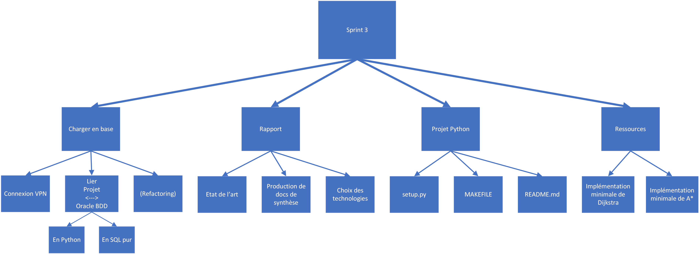

# Sprint 3

## Membres présents

-   Bouillon Pierre

-   Cesari Alexandre

## Sujet

Planification du sprint n°3

## Contenu

### WBS

### Répartition

-   Alexandre

    -   Rapport: état de l'art

    -   Rédation du `setup.py`

    -   Etablir la connexion VPN à la base Oracle de Telecom Nancy

    -   Production de documents de synthèse pour le rapport

-   Pierre

        -   Injection des données en base (projet `sql_bridge`)

        -   Rapport: choix des technologies

        -   Rédaction d'algorithmes minimaux pour:
            -   Dijkstra
            -   A*

        -   Finalisation du `MAKEFILE`

        -   Mise à jour du `README`

        -   Etablir la connexion VPN à la base Oracle de Telecom Nancy

        -   Production de documents de synthèse pour le rapport
