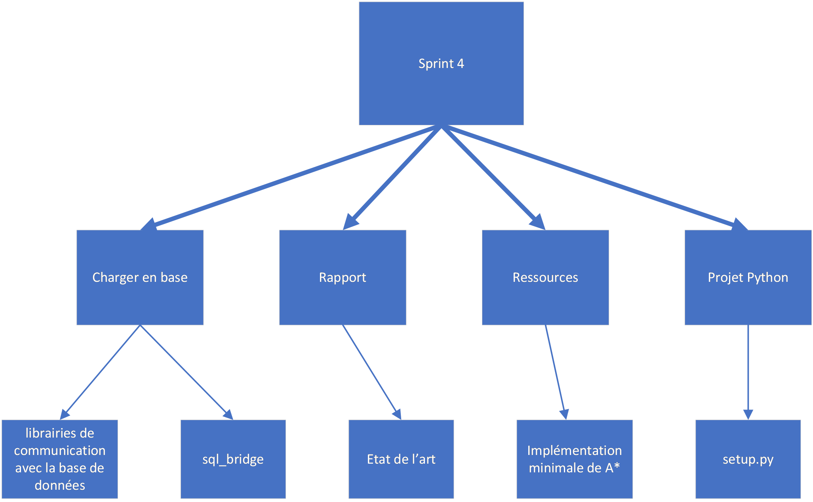

# Sprint 4

## Membres présents

-   Bouillon Pierre

-   Cesari Alexandre

## Sujet

Planification du sprint n°4

## Contenu

### WBS

### Répartition

-   Alexandre

    -   Rapport: état de l'art

    -   Rédaction du `setup.py`

    -   Installation des librairies de communication avec la base de données

    -   Coder et documenter l'algorithme _A\*_

-   Pierre

    -   Injection des données en base (projet `sql_bridge`)

    -   Installation des librairies de communication avec la base de données
