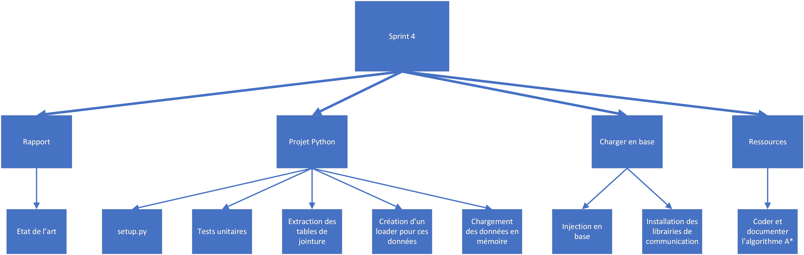

# Sprint 5

## Membres présents

-   Bouillon Pierre

-   Cesari Alexandre

## Sujet

Planification du sprint n°5

## Contenu

### WBS

### Répartition

-   Alexandre

    -   Rapport: état de l'art (_technichal debt_)

    -   Rédaction du `setup.py` (_technichal debt_)

    -   Installation des librairies de communication avec la base de données (_technichal debt_)

    -   Coder et documenter l'algorithme _A\*_ (_technichal debt_)

    -   Tests unitaires

-   Pierre

    -   Injection des données en base (projet `sql_bridge`) (_technichal debt_)

        - [x] Chargement des données en mémoire

        - [x] Création d'un loader pour ces données

        - [ ] Extraction des tables de jointure

        - [ ] Injection en base

    -   Génération du code SQL depuis les données en mémoire

    -   Tests unitaires    

    -   Installation des librairies de communication avec la base de données (_technichal debt_)
