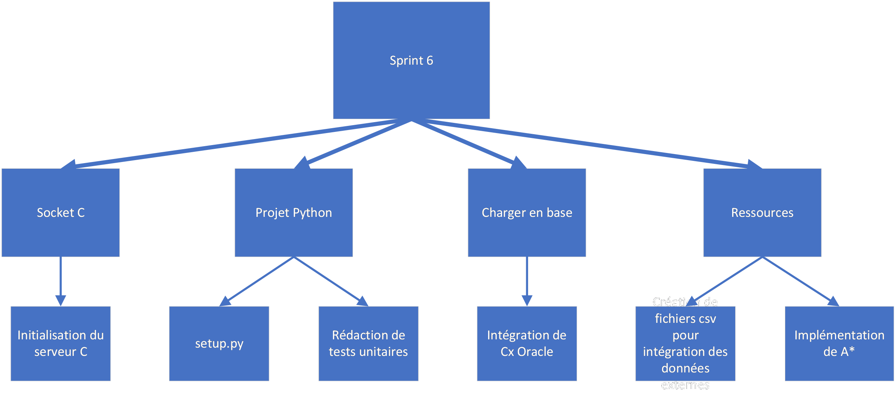

# Sprint 6

## Membres présents

-   Bouillon Pierre

-   Cesari Alexandre

## Sujet

Planification du sprint n°6

## Contenu

### WBS

### Répartition

- Alexandre
  - Intégration de _Cx Oracle_
  - Rédaction de tests unitaires
  - Implémentation de _A\*_
  - Finalisation des tâches reportées

- Pierre
  - Création de fichiers csv pour intégration des données externes
  - Initialisation du serveur C
